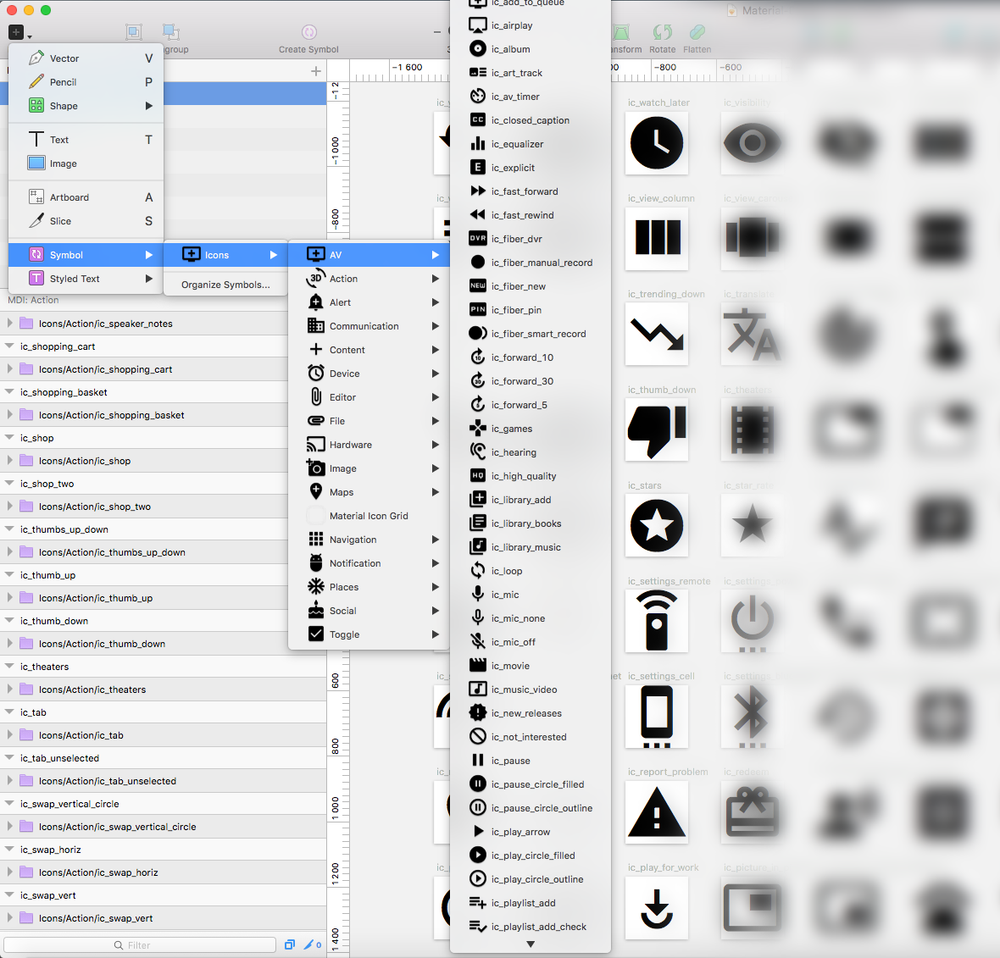
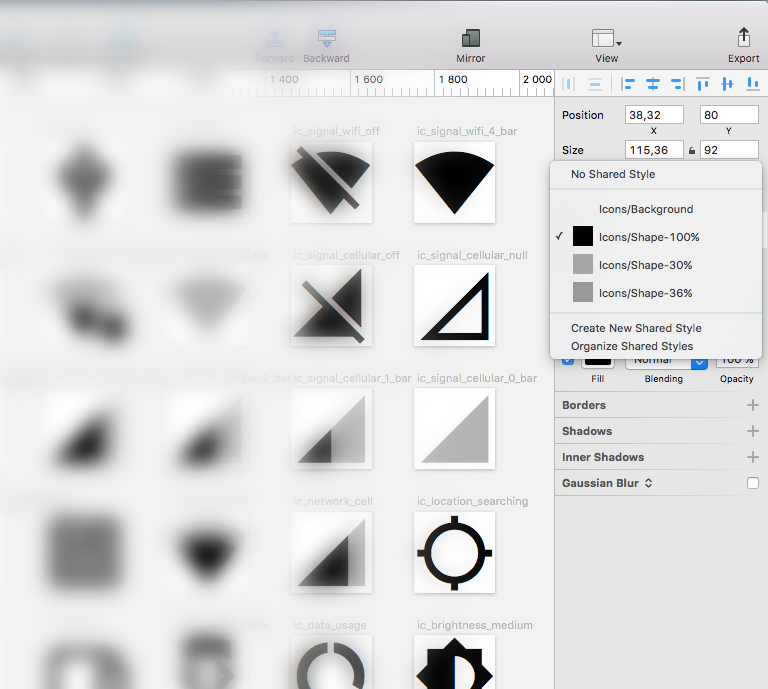
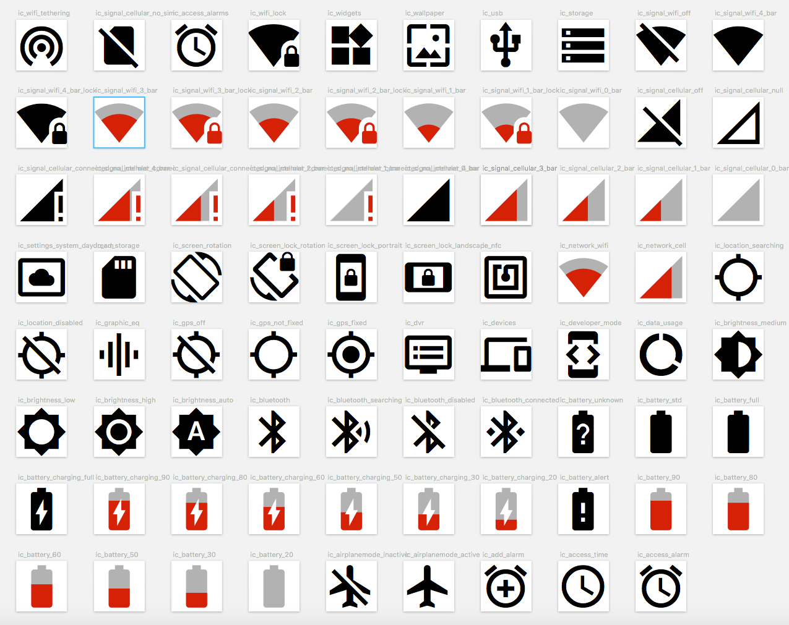
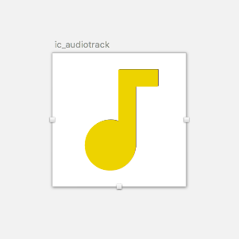
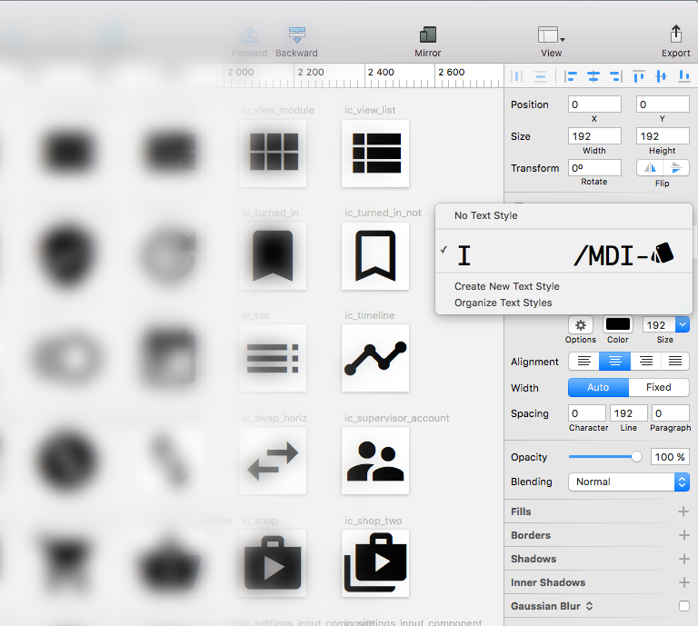

# Material Design Icons as a Sketch document
Sketch document with all the Material Design Icons graphical icons, structured as symbols and with shared styles.
The whole document is designed so you easily can extend your ongoing graphical work. Created by [Jonas Bröms](https://twitter.com/jonasbroms).

## Table of contents
* [File formats](#file-formats)
* [Install instructions](#install-instructions)
  * [Shape-based icons (heavy)](#shape-based-icons-heavy)
  * [Font-based icons (lightweight)](#font-based-icons-lightweight)
* [Icon Structure](#icon-structure)
* [Symbol Structure](#symbol-structure)
* [Shared styles structure](#shared-styles-structure)
* [Styled text](#styled-text)
* [Icons not included as a font](#icons-not-included-as-a-font)
* [What's new](#Whats-new)
* [Known bugs](#known-bugs)
* [Future improvements](#future-improvements)
* [Versioning](#versioning)
* [Creator](#creator)
* [Copyright and license](#copyright-and-license)

## File formats
* Sketch files
  * Shape-based icons (heavy, app. 24MB)
  * Font-based icons (lightweight, app. 9MB. **PLEASE READ INSTALL INSTRUCTIONS**)

## Install instructions
### Shape-based icons (heavy)
Download Download Material-Design-Icons-shapes.sketch, open the file and start using the document.

### Font-based icons (lightweight)
1. Download the Material Design Icons font [Click here](https://github.com/google/material-design-icons/tree/master/iconfont).
2. Install the font on your computer.
3. Download Material-Design-Icons-fonts.sketch, open the file and start using this document to extend your design.

## Icon structure

```
ic-theaters/
  ├── Icon (Shape or Font) - Shared
  └── Icon-background
```


## Symbol structure
For further and more detailed information, look at the picture.

```
Symbols/
└── Icons/
    ├── AV
    │   ├── Icon symbol #1...
    │   ├── Icon symbol #2...
    │   └── Icon symbol #3...
    ├── Action
    ├── Alert
    ├── Communication
    ├── Content
    ├── Device
    ├── File
    ├── Hardware
    ├── Image
    ├── Maps
    ├── Material Icon Grid
    ├── Navigation
    ├── Notification
    ├── Places
    ├── Social
    └── Toggle
```


## Shared styles structure
For further and more detailed information, look at the picture.

```
Shared styles/
└── Icons/
    ├── 100%
    ├── 36%
    ├── 30%
    └── 30%
```



## Styled text
For further and more detailed information, look at the picture.
```
Styled text/
└── Icons/
    └── MDI-style
```

## Icons not included as a font
All icons below cannot be controlled by the connection made to the "Text style/Icons/MDI". They can only be controlled thru "Share styles/Icons/**Shape-100%**, **Shape-36%** & **Shape-30%**"

* ic_star_rate
* ic_signal_wifi_0_bar
* ic_signal_wifi_1_bar
* ic_signal_wifi_1_bar_lock
* ic_signal_wifi_2_bar
* ic_signal_wifi_2_bar_lock
* ic_signal_wifi_3_bar
* ic_signal_wifi_3_bar_lock
* ic_signal_cellular_connected_no_internet_0_bar
* ic_signal_cellular_connected_no_internet_1_bar
* ic_signal_cellular_connected_no_internet_2_bar
* ic_signal_cellular_connected_no_internet_3_bar
* ic_signal_cellular_0_bar
* ic_signal_cellular_1_bar
* ic_signal_cellular_2_bar
* ic_signal_cellular_3_bar
* ic_network_cell
* ic_network_wifi
* ic_battery_charging_20
* ic_battery_charging_30
* ic_battery_charging_50
* ic_battery_charging_60
* ic_battery_charging_80
* ic_battery_charging_90
* ic_battery_20
* ic_battery_30
* ic_battery_50
* ic_battery_60
* ic_battery_80
* ic_battery_90



## What's new
* Two different sketch files
  * One shape-based icons sketch document (heavy)
  * One font-based icons sketch document (lightweight)
* Every icon is made into a symbol with the shape and a background
* Symbol Structure within Sketch for easier access
* All shared styles have a structure
* Documentation

## Known bugs
* Built-in bug in within the software of Sketch with the "Text style". Material Design Icon Font doesn't have any letters and is therefor more or less impossible to read when trying to apply it from the dropdown menu.  
* Alignment is different with approximately 0,1 - 1 pixel of approximately 33% of all the icons, compared to the SVG imported icons and Font based imported icons. For further information, see comparison between SVG (Black - Backgrond) and Font (Yellow - Foreground) below.




## Future improvements
* xSmall, Small, Medium, Large, xLarge symbols
* xSmall, Small, Medium, Large, xLarge shared styles
Eg.
```
Symbols/
└── Icons/
    ├── AV
    │   ├── Icon symbol #1...
    │   │     ├── xSmall
    │   │     ├── Medium
    │   │     ├── Large
    │   │     └── xLarge
    │   ├── Icon symbol #2...
    │   └── Icon symbol #3...
    ├── Action
    ├── Alert
    ├── Communication
    ├── Content
    ├── Device
    ├── File
    ├── Hardware
    ├── Image
    ├── Maps
    ├── Material Icon Grid
    ├── Navigation
    ├── Notification
    ├── Places
    ├── Social
    └── Toggle
```

## Versioning
0.1

## Creator
** Jonas Bröms **
* [Twitter](https://twitter.com/jonasbroms)
* [GitHub](https://github.com/bromso)
